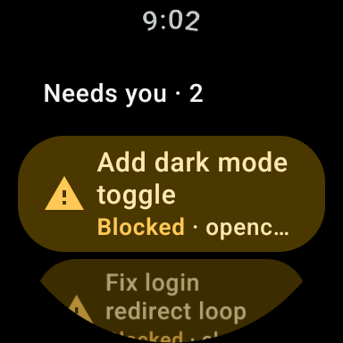
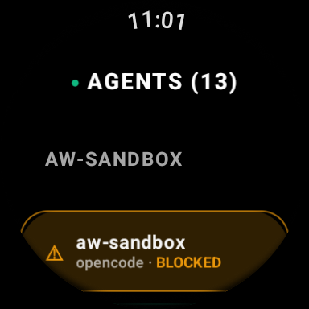
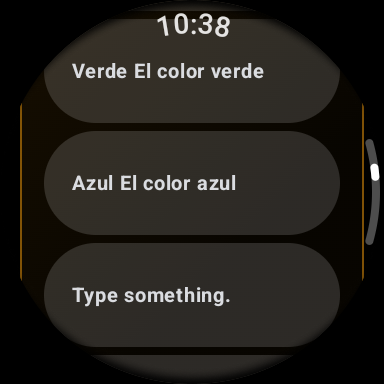

# Agent Watch

Agent Watch connects your wrist to your coding agents. When Claude Code, OpenCode, Antigravity, or other terminal agents need permission, ask a multiple-choice question, or finish a long task, Agent Watch alerts your smartwatch with glanceable context and actionable buttons (Allow, Deny, options, voice dictation). You can step away from the computer while it keeps running your agents: approve commands and follow progress from the watch.

> **Status (2026-09-25): alpha.** The host bridge, the relay and the Wear OS data layer went through a full review. The Wear OS UI is still the first alpha and is being redesigned, and the end-to-end checks are being re-run after that ([`docs/STATUS.md`](docs/STATUS.md)). The watchOS app is the legacy client until Phase 6.

<p align="center">
  
  
  
</p>

---

## Architecture

Agent Watch is built around a thin outbound host bridge, a minimal cloud relay, and native wrist clients:

```
┌──────────────────────────────────────────────┐
│  Host (Mac / Linux)                          │
│                                              │
│  [Coding Agents: Claude, OpenCode, AGY, ...] │
│         │ (pty / lifecycle hooks)            │
│         ▼                                    │
│  [herdr socket API ($HERDR_SOCKET_PATH)]     │
│         │ (UNIX socket, JSON-RPC)            │
│         ▼                                    │
│  [agent-watch-bridge (launchd / systemd)]    │
│         ▲ CLI                                │
│  [macOS menu bar app (optional)]             │
└──────────────────────┬───────────────────────┘
                       │
                       │ Outbound TLS WebSocket (WSS)
                       │ (No incoming ports, No VPN)
                       ▼
┌──────────────────────────────────────────────┐
│  Cloud Relay (VPS behind a TLS proxy)        │
│                                              │
│  [agent-watch-relay]                         │
│   ├── State Hub & In-Memory Cache            │
│   ├── Short-Lived Pairing & Device Auth      │
│   ├── SSE Broadcast (/v1/events)             │
│   ├── Push Dispatcher (FCM v1 / ntfy)        │
│   └── History Store (store.json)             │
└──────────────────────┬───────────────────────┘
                       │
                       │ HTTPS / SSE / FCM Push
                       ▼
┌──────────────────────────────────────────────┐
│  Smartwatch Clients                          │
│                                              │
│  • Wear OS (Google Pixel Watch 2 — Primary)  │
│  • watchOS (legacy client until Phase 6)     │
└──────────────────────────────────────────────┘
```

- **Outbound-Only Networking:** The host dials outbound to the relay. The watch never connects directly to your computer, and no VPN is required on the watch.
- **Sole Source of Truth:** Herdr is the authoritative multiplexer and control plane. Agent Watch interfaces cleanly through Herdr's verified socket API.
- **Any TLS reverse proxy** in front of the relay works (nginx, Caddy, Nginx Proxy Manager; Cloudflare optional). See [`deploy/relay/README.md`](deploy/relay/README.md).

---

## Requirements

1. **Herdr:** `herdr` ≥ 0.9.1 (verified on 0.9.1) on the machine that runs your agents, with its integrations installed for your agents (`herdr integration status`).
2. **Go 1.22+** to build the bridge and the relay (`CGO_ENABLED=0`, static binaries).
3. **Cloud Relay:** a small Linux VPS (1 vCPU, 512 MB RAM) with a public domain (e.g. `relay.example.com`) and a TLS reverse proxy that passes WebSockets and unbuffered SSE.
4. **Smartwatch:**
   - **Wear OS** 3 or later (the app's `minSdk` is 30) — *primary; verified only on a Google Pixel Watch 2*.
   - **watchOS** — *legacy client* (the pre-relay LAN client), not yet on the relay API; Phase 6 rewrites it, simulator-only.
5. **To build the Wear OS app:** JDK 17 (Android Studio's bundled JBR works), the Android SDK, `adb`, and your own **Firebase project** for push.

---

## Setup Guide

Follow the steps in order. Placeholders: `relay.<domain>` is your relay's hostname, `<vps>` its SSH target.

### 1. Deploy the Cloud Relay

1. Generate the host token that the relay and the bridge share (keep it secret):
   ```bash
   openssl rand -hex 32
   ```
2. Deploy `agent-watch-relay` with systemd behind your TLS proxy, with the token as `AW_HOST_TOKEN` in `/etc/agent-watch-relay/env`:
   - first-time setup: [`docs/phases/3c-relay-deploy.md`](docs/phases/3c-relay-deploy.md);
   - operations, the Nginx Proxy Manager-in-docker topology, client IP (`AW_TRUSTED_PROXIES`), devices: [`deploy/relay/README.md`](deploy/relay/README.md);
   - updates: `deploy/relay/deploy.sh <vps>` (clean tree only; health check and automatic rollback).
3. Verify the relay is reachable:
   ```bash
   curl https://relay.<domain>/v1/healthz
   # Expected: {"ok":true}
   ```

### 2. Install and Configure the Host Bridge

On the machine that runs herdr:

1. Build the bridge binary:
   ```bash
   make bridge
   ```
2. Link the plugin into herdr (absolute path):
   ```bash
   herdr plugin link "$PWD"
   ```
3. Configure the relay URL and host token (writes `config.toml`, mode `0600`; `/v1/host` is appended to the URL):
   ```bash
   ./bin/agent-watch-bridge configure --relay-url wss://relay.<domain> --host-token <64-hex-token>
   ```
   `configure` is a CLI command, not a plugin action (it takes the token as an argument). The file is `~/.config/herdr/plugins/config/herdr-agent-watch/config.toml` by default.
4. Start the bridge service (a LaunchAgent on macOS, a `systemd --user` unit on Linux):
   ```bash
   herdr plugin action invoke --plugin herdr-agent-watch start
   # or: ./bin/agent-watch-bridge start
   ```
5. Verify the bridge:
   ```bash
   ./bin/agent-watch-bridge status
   # bridge: running (pid …); relay: connected to relay.<domain>; herdr: online; agents: N (M blocked)
   ```

### 3. Build and Install the Wear OS App

1. **Firebase:** create a Firebase project, add an Android app with the package name `com.gabriel.agentwatch`, and download its `google-services.json` to `wearos-app/app/`. It is git-ignored; never commit it. The build fails without it.
2. **Build** with JDK 17:
   ```bash
   cd wearos-app
   export JAVA_HOME="/Applications/Android Studio.app/Contents/jbr/Contents/Home"   # or any JDK 17
   ./gradlew :app:testDebugUnitTest :app:assembleDebug
   ```
3. **Connect the watch over wireless debugging.** The Pixel Watch has no USB data connection, so `adb` goes over Wi-Fi (watch and computer on the same network):
   - on the watch: Settings → Developer options → **Wireless debugging** → **Pair new device**;
   - on the computer: `adb pair <ip>:<pair-port> <code>`, then `adb connect <ip>:<port>` (the connect port is shown on the Wireless debugging screen and changes after a reboot).
4. **Install:** `./gradlew :app:installDebug`.
5. **Push on the relay:** put the Firebase **service-account** JSON on the VPS only and set `AW_FCM_CREDENTIALS` (`deploy/relay/env.example`). Without it the relay runs with push disabled.

The release build (`assembleRelease`, R8 on) is signed with the debug key: fine for your own watch, not for distribution.

### 4. Pair Your Smartwatch

1. Get a short-lived 6-digit pairing code (valid 5 minutes):
   ```bash
   ./bin/agent-watch-bridge pair
   # or: herdr plugin action invoke --plugin herdr-agent-watch pair
   ```
   It shows the code, its real expiry and the relay URL, and also posts a herdr notification. `pair` needs only the config and the relay, not a running bridge.
2. On the watch, open Agent Watch, enter your relay URL (`https://relay.<domain>`; `https://` is added if you leave it out) and the code.
3. The watch exchanges the code for a device token (the relay stores only its SHA-256 hash) and registers for push. Your agents appear.

### 5. Optional: macOS Menu Bar App

A small menu bar companion that shows whether the bridge runs and is connected, and how many agents are blocked, and starts, stops, restarts and pairs through the bridge CLI:

```bash
make bar && open bin/AgentWatchBar.app
```

Details: [`macos-bar/README.md`](macos-bar/README.md).

### Day-to-day

| Command | What it does |
|---|---|
| `make restart` | Rebuild `bin/agent-watch-bridge` and restart the installed service without rewriting its definition |
| `./bin/agent-watch-bridge restart` | Restart only (also a plugin action) |
| `./bin/agent-watch-bridge start` | Install or rewrite the service definition; keeps the installed values unless a flag or herdr's environment gives new ones |
| `./bin/agent-watch-bridge stop` | Stop the service |
| `./bin/agent-watch-bridge status` | Human status, including the relay's view; exit 1 when the bridge is not running |
| `./bin/agent-watch-bridge status --json --local` | Local files only, no network: what the menu bar reads ([`contracts.md` §6.2](docs/reference/contracts.md)) |
| `sudo agent-watch-relay devices list` / `devices revoke <id>` | On the VPS; works with the relay running, and a revoke takes effect at once |

---

## Supported Agents

All agent-specific approval menu parsing and key mappings live in `pkg/agents` ([`docs/reference/agents.md`](docs/reference/agents.md)):

| Agent | Status | Approval UI | Key Mapping | Transcript History |
|---|---|---|---|---|
| **Claude Code** (`claude`) | First-class | Numbered permission menu, plan approval, AskUserQuestion | Digit direct | JSONL tail reader + screen fallback |
| **OpenCode** (`opencode`) | First-class | Framed button bar (`Allow once`, `Allow always`, `Reject`); question tool | `Enter` / `Right, Enter, Enter` (confirm stage) / `esc` | SQLite (`opencode.db`, read-only) + screen fallback |
| **Antigravity CLI** (`agy`) | First-class, with a herdr gap (Known issues) | Numbered box menu (`Command`, `Pending edit`) | Digit direct | JSONL + screen fallback |
| **Generic** | Universal fallback | Any numbered list matching `^\d+[.)]` | Digit direct | Screen capture |

For claude, agy and opencode a menu counts only while its dialog is open, so a numbered list in an answer is never taken for a menu.

---

## Security Model

- **Outbound-only host:** The bridge opens an outbound TLS WebSocket (`wss://relay.<domain>/v1/host`). No inbound ports, listeners, or open firewall holes on your computer.
- **Hashed device tokens:** The relay stores only `sha256(device_token)`. If the relay's store were compromised, existing tokens cannot be reconstructed. Devices are revocable at once (`agent-watch-relay devices revoke`).
- **Rate-limited pairing:** 6-digit codes, 5-minute TTL, single use; attempts are limited per client IP, which the relay takes from forwarding headers only when they come from a proxy listed in `AW_TRUSTED_PROXIES`.
- **Zero raw keys:** The watch client never sends raw key presses or terminal input. The watch sends high-level actions (`answer` with option ID, `cancel`, or `prompt` text). The host bridge maps actions to keys itself.
- **Strict safety checks:** Right before pressing keys, the bridge re-lists the agent from herdr and re-reads the screen, and verifies:
  1. The pane has a detected agent.
  2. `expected_seq` matches the agent's current state.
  3. The prompt fingerprint matches what is parsed on the screen now (for `cancel` too).
- **Once only:** a repeated request, a second answer to the same prompt, or the same dictated text sent twice is refused, so a double tap never types twice.
- **No typing into menus:** dictation is refused while a menu is on screen, whatever herdr reports.
- **Sanitized logs:** The relay and bridge logs never print prompt contents, transcript text, or authentication tokens.

---

## Known Issues

- **herdr 0.9.1 misses some open permission dialogs** (reports `done`/`idle`/`working` instead of `blocked`): every Antigravity CLI 1.2.x dialog, and any Claude Code dialog after Claude was relaunched in the same pane. The bridge only publishes prompts for `blocked` agents, so without a workaround the watch cannot answer them. **Workaround:** temporary local detection overrides for herdr in [`tools/herdr-overrides/`](tools/herdr-overrides/README.md) (`herdr-overrides.sh install`; run `check` after herdr updates its manifests and `uninstall` once upstream handles these dialogs). While a dialog is open, dictation to that agent is refused ("Answer the question first").
- **OpenCode keys assume the default focus.** Approvals press keys relative to `Allow once`, the button OpenCode focuses when the dialog opens. If someone moved the focus at the computer (arrow keys or mouse hover) before the watch answers, `Enter` acts on the focused button. Reject (`esc`) is always safe.
- **watchOS is the legacy client.** The Apple Watch app does not use the relay API yet; Phase 6 rewrites it (simulator-only, best-effort).
- **Wear OS UI is an alpha** and is being redesigned; the `resolved` push (which withdraws answered approvals) stays off on the relay (`AW_PUSH_RESOLVED`) until the new app ships.

---

## Troubleshooting

- **Check status anytime:**
  ```bash
  ./bin/agent-watch-bridge status
  # or: herdr plugin action invoke --plugin herdr-agent-watch status
  ```
- **Log files:**
  - Bridge logs: `~/Library/Logs/agent-watch-bridge.log` (macOS), `journalctl --user -u agent-watch-bridge` (Linux)
  - Relay logs: `journalctl -u agent-watch-relay -f` on the VPS
- **"Mac offline" banner:**
  - Displayed on the watch when the host bridge disconnects from the relay (e.g. the computer is asleep, or the bridge stopped). The relay also pings the bridge and drops a silent one within about 40 s.
  - Existing history remains browsable on the watch.
  - When the computer wakes up, the bridge automatically reconnects and clears the banner without user intervention.
- **"herdr stopped" indicator:**
  - Indicates that the bridge is running but the herdr daemon is not responding on its UNIX socket. Start herdr to restore live monitoring.
- **Relay rejects the host token:** `status` shows the relay error; re-run `configure` with the relay's `AW_HOST_TOKEN`, then `./bin/agent-watch-bridge restart`.

---

## Documentation

- [`HERDR_REFACTOR_PLAN.md`](HERDR_REFACTOR_PLAN.md): the design.
- [`docs/README.md`](docs/README.md): phase guides and references; [`docs/STATUS.md`](docs/STATUS.md): what is done and verified.
- [`docs/reference/contracts.md`](docs/reference/contracts.md): every JSON shape and the relay's configuration.
- [`ROADMAP.md`](ROADMAP.md): what comes next.
