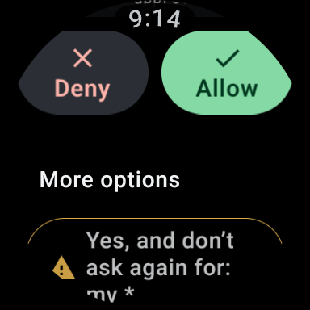

# Agent Watch

Answer your coding agents from your wrist. When Claude Code, OpenCode, Antigravity or another terminal agent asks for permission, asks a question or finishes a task, your watch shows it with the ways to answer: Allow, Deny, the agent's own options, or a dictated prompt.

> **Beta, in daily use** on a Pixel Watch 2. What works, what is open and what comes next: [`docs/STATUS.md`](docs/STATUS.md).

<p align="center">
  
  
  
  
</p>
<p align="center"><sub>Wear OS app, sample agents in a sandbox workspace.</sub></p>

---

## How It Works

```
your agents ─▶ herdr ─▶ agent-watch-bridge ══ WSS ══▶ agent-watch-relay ══ HTTPS · SSE · push ══▶ watch
               └──── your Mac or Linux box ────┘      └──── your VPS ────┘
```

- **[herdr](https://herdr.dev)** runs your agents and knows what each one is doing.
- **The bridge** runs on your computer and only dials out: no open ports, no VPN.
- **The relay** is a small server you host. The watch talks only to it, over Wi-Fi, LTE or its phone's connection.
- **The watch never sends keystrokes.** It sends "answer option X", and the bridge checks the prompt on screen is still the same before pressing anything.

---

## What You Need

- **herdr** ≥ 0.9.1 and **Go** 1.22+ on the computer that runs your agents.
- A small **Linux VPS** with a domain and a TLS reverse proxy, for the relay.
- A **Wear OS** 3+ watch (tested on a Pixel Watch 2), plus JDK 17, the Android SDK and your own **Firebase** project (for push) to build the app.

---

## Quick Start

1. **Configure:** `make config`, then set your relay domain and SSH target in `agent-watch.env`. It is the one config file, git-ignored.
2. **Relay:** prepare the VPS once ([guide](docs/GUIDE.md#1-deploy-the-cloud-relay)), then `make deploy-relay ARGS=--sync-env`.
3. **Bridge**, on the computer that runs herdr:
   ```bash
   make bridge
   herdr plugin link "$PWD"
   make configure-bridge
   ./bin/agent-watch-bridge start
   ```
4. **Watch app:** put your `google-services.json` in `wearos-app/app/`, connect the watch over wireless `adb`, and run `./gradlew :app:installDebug` in `wearos-app/`.
5. **Pair:** `./bin/agent-watch-bridge pair`, and enter the code on the watch.

**Optional:** the macOS menu bar app shows whether the bridge and the relay are up: `make bar && open bin/AgentWatchBar.app`.

Every step in detail, the day-to-day commands and troubleshooting are in **[the full guide](docs/GUIDE.md)**.

### Install with herdr

Agent Watch is a herdr plugin, listed on [herdr.dev/plugins](https://herdr.dev/plugins/):

```bash
herdr plugin install gabrielmarcano/agent-watch
```

- It builds the bridge on your machine, so it needs **Go 1.22+**.
- It covers the bridge only. The relay, the watch app and pairing are still needed ([guide](docs/GUIDE.md#alternative-install-the-bridge-with-herdr)). Not yet tested end to end.

Prebuilt bridge, relay and menu bar binaries are on the [releases page](https://github.com/gabrielmarcano/agent-watch/releases).

---

## Supported Agents

**Claude Code**, **OpenCode** and **Antigravity CLI** are first-class; any other agent herdr detects works through its numbered menus. What each one supports: [the guide](docs/GUIDE.md#supported-agents).

---

## Documentation

- **[Full guide](docs/GUIDE.md):** setup, operations, versions and releases, CI, security model, known issues, troubleshooting.
- [Status and roadmap](docs/STATUS.md) · [Contracts](docs/reference/contracts.md)
- Contributing with a coding agent: start with [`AGENTS.md`](AGENTS.md).

---

## Support

If Agent Watch saves you trips to the keyboard, you can [buy me a coffee on Ko-fi](https://ko-fi.com/gabrielmarcano120). Bug reports and ideas are welcome as [issues](https://github.com/gabrielmarcano/agent-watch/issues).

---

## License

Copyright 2026 Gabriel Marcano. Licensed under the [Apache License, Version 2.0](LICENSE); see also [`NOTICE`](NOTICE).

Contributions are accepted under the same license. The license does not grant rights to the "Agent Watch" name (section 6).
